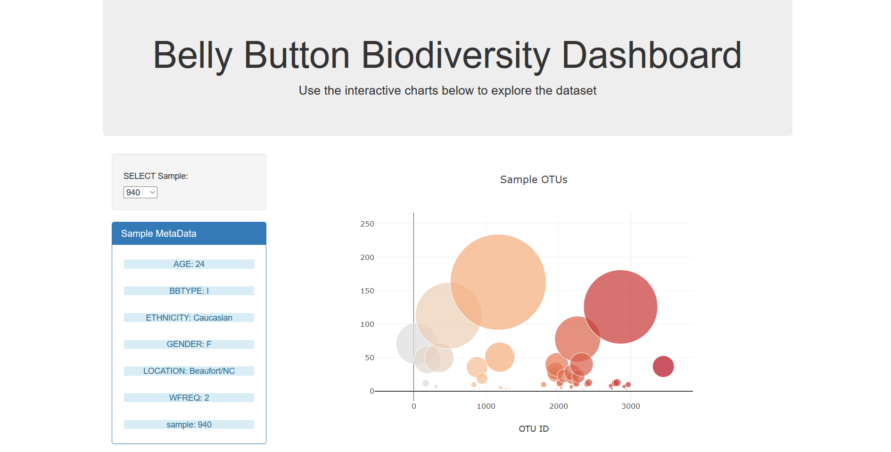
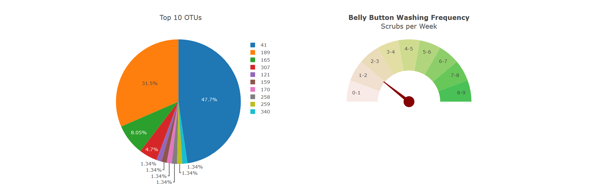

In this project, plotly.js was used to build an interactive dashboard to explore the belly button biodiversity dataset.

## Javascript Code

```javascript

function buildMetadata(sample) {

	// Use `d3.json` to fetch the metadata for a sample
	d3.json("/metadata/" + sample).then((sampleMetadata) => {   		
  
		// Use d3 to select the panel with id of `#sample-metadata`
		var sample_metadata_selector = d3.select("#sample-metadata");

		// Use `.html("")` to clear any existing metadata
		sample_metadata_selector.html("");

		// Use `Object.entries` to add each key and value pair to the panel
		Object.entries(sampleMetadata).forEach(([key, value]) => {
			var listItem = sample_metadata_selector.append("li")
				.attr("class", "list-group-item")
				.attr("style", "border: none; margin: -10px;");
			listItem.append("h5")
				.attr("class", "list-group-heading list-group-item-info text-center")
				.text(key + ": " + value);	
			});
	});
}

function buildGauge(sample) {

	// Use `d3.json` to fetch the wfreq metadata for a sample
	d3.json("/wfreq/" + sample).then((sampleMetadata) => {   		

		// Set variable for number of scrubs
		var wfreq = sampleMetadata["WFREQ"];

		// Convert wfreq in order to make maximum possible value be 180
		var converted_wfreq = parseFloat(wfreq) * 20;

		// Calculate meter point using trigonometry
		var degrees = 180 - converted_wfreq;
		var radius = 0.5;
		var radians = degrees * Math.PI / 180;
		var x = radius * Math.cos(radians);
		var y = radius * Math.sin(radians);

		// Create the path directions for generating the gauge pointer
		var mainPath = "M -.0 -0.025 L .0 0.025 L ",
			 pathX = String(x),
			 space = " ",
			 pathY = String(y),
			 pathEnd = " Z";
		var path = mainPath.concat(pathX, space, pathY, pathEnd);

		var gaugeData = [

			// Create the base of the gauge pointer
			{
				type: "scatter",
				x: [0],
				y: [0],
				marker: {size: 28, color:"850000"},
				showlegend: false,
				name: "scrubs",
				text: wfreq,
				hoverinfo: "text+name"
			},
			
			// Create the gauge chart
			{
				// 10 values total. Final value is equal to half of the pie.
				// Other 9 values must add up to final value to make the other half.
				values: [81/9, 81/9, 81/9, 81/9, 81/9, 81/9, 81/9, 81/9, 81/9, 81],  
				rotation: 90,
				text: ["8-9", "7-8", "6-7", "5-6",
						"4-5", "3-4", "2-3", "1-2", "0-1", ""],
				textinfo: "text",
				textposition: "inside",
				marker: {
					colors:["#49C156",
					"#67C759",
					"#8ECE6A", 
					"#B1D57D",
					"#CFDC90", 
					"#E3DFA4",
					"#EADBB9",
					"#F1DFCF",
					"#F8EAE6",
					"#FFFFFF" // This color must match the background color
						  // the gauge chart is on
					 ]},
				hoverinfo: "none",
				hole: 0.5,
				type: "pie",
				showlegend: false}
			];

		var gaugeLayout = {
			
			// Create the gauge pointer
			shapes:[{
				type: "path",
				path: path,
				fillcolor: "850000",
				line: {
					color: "850000"
				}
			}],
			
			title: "<b>Belly Button Washing Frequency</b><br>Scrubs per Week",
			height: 500,
			width: 500,
			xaxis: {zeroline:false, showticklabels:false,
					 showgrid: false, range: [-1, 1]},
			yaxis: {zeroline:false, showticklabels:false,
					 showgrid: false, range: [-1, 1]}
			};

		Plotly.newPlot("gauge", gaugeData, gaugeLayout, {responsive: true});

	});
}

function buildCharts(sample) {

	// Use `d3.json` to fetch the data for a sample
	d3.json("/samples/" + sample).then((sampleData) => {  
		
		// Create the bubble chart		
		var bubbleTrace = {
			x: sampleData["otu_ids"],
			y: sampleData["sample_values"],
			text: sampleData["otu_labels"],
			mode: "markers",
			marker: {
				color: sampleData["otu_ids"],
				size: sampleData["sample_values"]
			}
		};

		var bubbleData = [bubbleTrace];

		var bubbleLayout = {
			title: "Sample OTUs",
			showlegend: false,
			height: 500,
			width: 700,
			xaxis: {
				title: "OTU ID"
			}
		};

		Plotly.newPlot("bubble", bubbleData, bubbleLayout, {responsive: true});


		// Use slice() to get the top 10 sample values, otu_ids, and labels
		// for the pie chart
		const top10_otu_ids = sampleData["otu_ids"].slice(0, 10);
		const top10_otu_labels = sampleData["otu_labels"].slice(0, 10);
		const top10_sample_values = sampleData["sample_values"].slice(0, 10);

		// Create the pie chart 
		var pieTrace = {
			labels: top10_otu_ids,
			values: top10_sample_values,
			hovertext: top10_otu_labels,
			type: "pie"
		};

		var pieData = [pieTrace];

		var pieLayout = {
			title: "Top 10 OTUs",
			height: 500,
			width: 500
		};

		Plotly.newPlot("pie", pieData, pieLayout, {responsive: true});

	});
}

function init() {

	// Grab a reference to the dropdown select element
	var selector = d3.select("#selDataset");

	// Use the list of sample names to populate the select options
	d3.json("/names").then((sampleNames) => {
		sampleNames.forEach((sample) => {
			selector
				.append("option")
				.text(sample)
				.property("value", sample);
		});

		// Use the first sample from the list to build the initial plots
		const firstSample = sampleNames[0];
		buildCharts(firstSample);
		buildMetadata(firstSample);
		buildGauge(firstSample);
	});
}

function optionChanged(newSample) {

	// Fetch new data each time a new sample is selected
	buildCharts(newSample);
	buildMetadata(newSample);
	buildGauge(newSample);
}

// Initialize the dashboard
init();


```

## Interactive Dashboard Website




